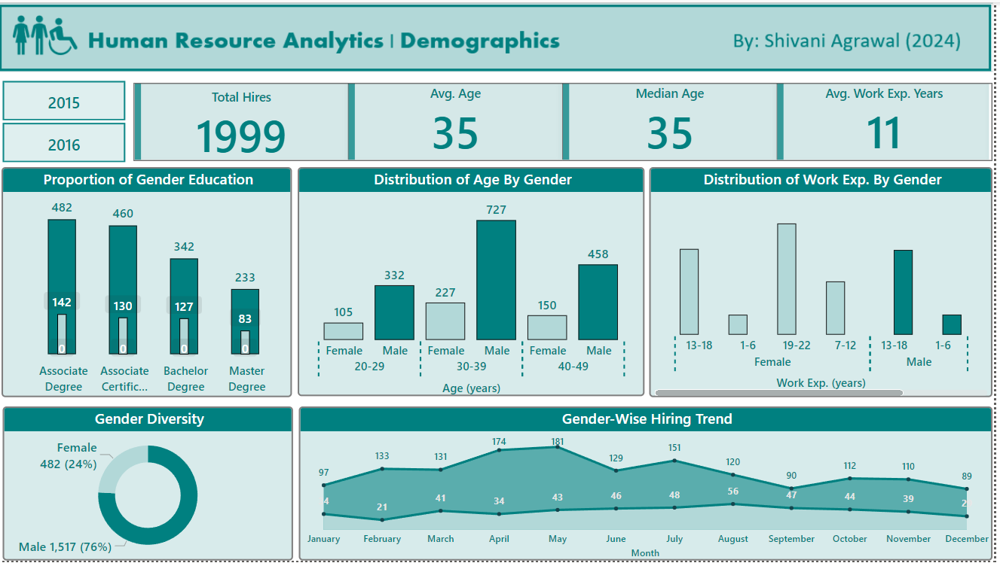
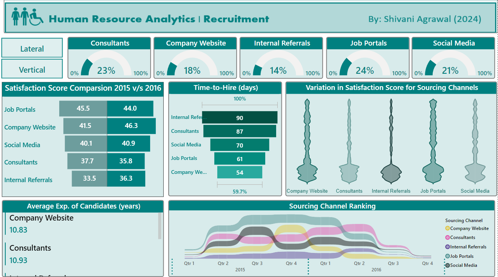
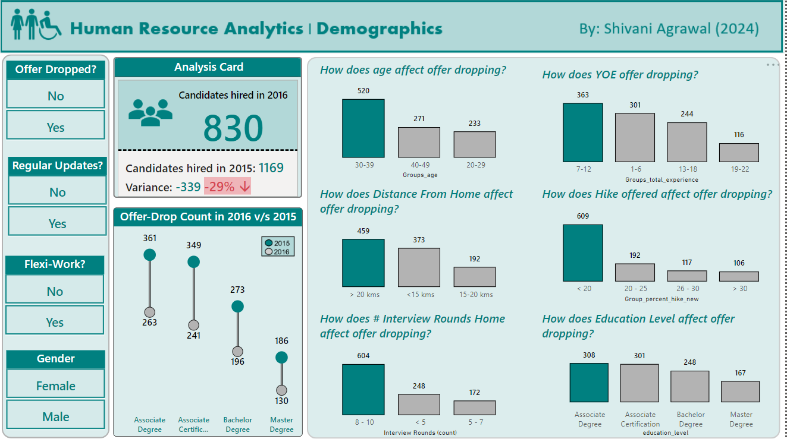

# RenegeDataModel
This code repo is to upload the code of Renege Data Machine Learning Models

## 🚀 Offer Dropout Prediction in Recruitment  
This project leverages **predictive modeling** and **data visualization** to address the critical issue of candidate offer dropouts (renege) in talent acquisition. By integrating machine learning algorithms with actionable insights, it provides HR teams with data-driven tools to improve hiring efficiency and reduce costs.  

---

## 🎯 Project Objective  
To develop a **predictive analytics framework** that identifies candidates at risk of declining job offers, enabling proactive interventions to reduce hiring delays and costs.  

---

## 🔑 Key Features  

### 📊 Data Analysis:  
- Designed a **Power BI dashboard** to analyze **demographics**, **recruitment satisfaction**, and **offer dropout trends**.  
- Uncovered key factors like **age**, **distance from office**, and **number of interview rounds** influencing dropouts.  

The data analysis was divided into three key themes to uncover insights and trends:

### 🧑‍🤝‍🧑 Theme 1: Demographic Analysis  
- Analyzed key demographic factors, such as **age**, **gender diversity**, and **work experience distribution**, to identify trends that impact offer dropouts. For example, employees aged **30-39** represented the largest age group with the highest dropout rates.  
- Examined **gender diversity** with **24% female employees**, and discovered significant hiring trends, such as the highest number of hires in **May** and the lowest in **December**.  



---

### 📋 Theme 2: Sourcing Channel Analysis  
- Compared the **satisfaction scores** across different sourcing channels, highlighting a **decrease** in satisfaction for **Job Portals** and **Consultants**, while other channels showed improvement.  
- Evaluated the **time-to-hire** for internal referrals (**90 days**) and company website applications (**54 days**), uncovering an important insight: even with the shortest time-to-hire, the company website’s satisfaction ratings dropped in **2016**.  



---

### 🚪 Theme 3: Renege Analysis  
- Identified that **candidates aged 30-39** had the highest offer drop-out rate (**520** dropouts), while **distance from home** also emerged as a significant factor, with candidates living **>20 km** from the office showing the highest dropout rate (**459**).  
- Found that candidates with an **Associate degree** had the highest **offer drop count** (**308**), and candidates who went through **8-10 interview rounds** were more likely to renege on the offer.  



---

### 🤖 Data Science:  
- Built and evaluated multiple machine learning models, including **Random Forest**, **Gradient Boosting**, **Decision Tree**, and **Logistic Regression**.  
- Achieved **97.7% accuracy** using **Random Forest**, identifying key predictors such as **Satisfaction Index** and **Days-to-Offer**.  

---

## 📂 Data and Methodology  

### Dataset:  
Recruitment data for **2015-2016**, including candidate demographics, interview details, and offer timelines.  

### Steps:  
1. **Data cleaning** and **feature engineering** (e.g., "Days-to-Offer").  
2. **Model training** and **hyperparameter tuning** (e.g., Grid Search).  

---

## 📈 Results  

1. Identified actionable thresholds, such as **Satisfaction Index ≤ 24.5**, significantly impacting drop-out likelihood.  
2. Provided HR with interpretable models and tools to streamline processes, enhance candidate satisfaction, and offer competitive packages.  

---

## 🌟 Future Scope  

1. **Integration with external data sources** (e.g., market trends via Payscale).  
2. **Extension to other HR functions**, such as employee retention prediction.  

---

### How to Run  
1. Clone the repository:  
   ```bash
   git clone <repository-url>
   cd <repository-folder>

